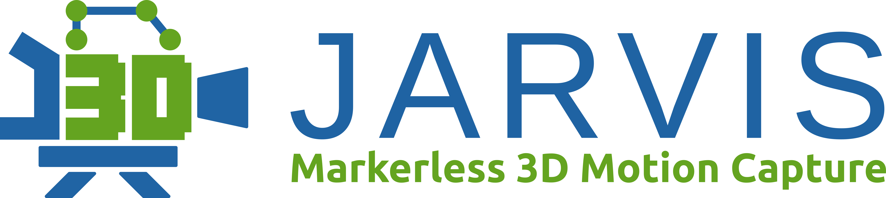

# JARVIS AnnotationTool

This is the official Github Repository for the **JARVIS Annotation Tool**. To find out more about our 3D markerless motion capture toolbox have a look at 
**[our website](https://jarvis-mocap.github.io/jarvis-docs/)**.

All you need to get started are synchronized multi-camera recordings (check out our [AcquisitionTool](https://github.com/JARVIS-MoCap/JARVIS-AcquisitionTool)) and calibration recordings using a simple checkerboard or ChArUco-board. 
The AnnotationTool has functionallity to **extract representative frames** from your recordings in a semi-supervised fashion and it can be used to **calibrate your cameras**.\
It then uses live updating reprojection-error statistics to make the process of **creating 3D keypoint annotations** as intuitive and precise as possible. If you have real world measurements of the animal or object you're annotating (e.g. the length of all finger segments) you can also use those metrics to guide you during the annotation process.

**Installing our prebuild packages is easy!** Just go to **[our downloads page](https://jarvis-mocap.github.io/jarvis-docs//2021-10-29-downloads.html)** and grab the installer for your operating system. We currently support Windows, MacOS and Ubuntu 20.04/18.04. Installers for the current and previous versions can also be found under [Releases](https://github.com/JARVIS-MoCap/JARVIS-AnnotationTool/releases).

If you want to build the tool yourself here's a step by step guide on how to do it. If the prebuild OpenCV, Qt and yaml-cpp libraries we ship it with don't work for you there's a guide on how to [build the dependencies](#building-opencv-qt5-and-yaml-cpp-yourself) at the bottom of this page. (Please note that the guide is currently not verified, please let us know if you run into any issues!)

 

# Building from Source

## Linux

### Installing the dependencies
To be able to build the tool install all the dependencies with

      sudo apt install cmake git build-essential libxcb-xinerama0 libdouble-conversion-dev gstreamer1.0-libav ffmpeg libxcb-xinput0 libpcre2-dev libeigen3-dev libgl-dev
      
### Cloning the repository
Next clone our repository with 

     git clone --recursive https://github.com/JARVIS-MoCap/JARVIS-AnnotationTool.git
     
     
Change to the repositories main directory

     cd JARVIS-AnnotationTool
     
### Building and installing
Build Qt and OpenCV using the provided setup script by runnning

     sh setup.sh
     
Create and enter a build directory 

    mkdir build && cd build
    
Run cmake to configure and build the AnnotationTool

	cmake .. && cmake --build . --parallel 8
     
If you want to create a debian package go to the deployment folder and run (replace XX04 by your Ubuntu Version)

     sh deploy_Ubuntu_XX04.sh

And finally install with (replacing the Xs with the numbers in the package you created)

     sudo apt install ./JARVIS-AnnotationTool_X.X-X_amd64_XX04.deb
     
If you want to remove it run

     sudo dpkg -r AnnotationTool

## MacOS 
Make sure you have all the necessary build tools (like cmake) installed.

### Cloning the repository
Next clone our repository with 

     git clone --recursive https://github.com/JARVIS-MoCap/JARVIS-AnnotationTool.git
     
Go into the repository and create a build directory

    cd JARVIS-AnnotationTool && mkdir build && cd build
    
### Building and installing 
Run cmake (replace XX04 by either 2004 or 1804) depending on your Ubuntu Version.

    cmake ..
	
Run make to build the tool (replace x by the number of available cores on your CPU)

     make -jx
     

## Windows
Make sure you have a version of Visual Studio Code installed (If you plan to build the AcquisitionTool installed it is best to use VSCode 2015).
Also make sure you have git installed and run the following in the git bash console:

### Cloning the repository
Next clone our repository with 

     git clone --recursive https://github.com/JARVIS-MoCap/JARVIS-AnnotationTool.git
     
Go into the repository and create a build directory

    cd JARVIS-AnnotationTool && mkdir build && cd build

### Building and installing 
Switch to a VS Developer Command Prompt and run the following two commands to enable the 64bit built system:

    cd VC
    vcvarsall.bat amd64

Then run cmake

    cmake -DCMAKE_BUILD_TYPE=Release .. -G "NMake Makefiles"
	
Run make to build the tool (replace x by the number of available cores on your CPU)

    cmake --build . -j8
	
We currently use the free version Advanced Installer to create our '.msi' installer files. This is not an optimal solution, so if you know how to build a better pipeline to build them please feel free to implement that!

  
# Building OpenCV yourself

## Linux and MacOS
- On MacOS: build [libjpeg turbo](https://github.com/libjpeg-turbo/libjpeg-turbo) from git (make sure to build Version 8!)

  
    
